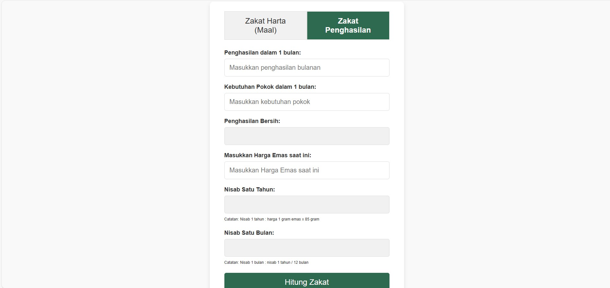

#  Kalkulator Zakat Penghasilan dan Zakat Maal



Kalkulator Zakat Penghasilan adalah aplikasi web sederhana yang membantu pengguna menghitung jumlah zakat yang harus mereka bayar berdasarkan penghasilan bersih bulanan mereka dan nisab yang dihitung dari harga emas terkini. Aplikasi ini dirancang dengan antarmuka yang ramah pengguna, sehingga memudahkan pengguna dalam memasukkan data dan mendapatkan hasil perhitungan secara instan.

## Fitur Utama

- Perhitungan Penghasilan Bersih: Menghitung penghasilan bersih pengguna dengan mengurangkan kebutuhan bulanan dari penghasilan bulanan.
- Perhitungan Nisab: Menghitung nilai nisab (batas minimal penghasilan yang wajib zakat) berdasarkan harga emas saat ini.
- Perhitungan Zakat: Menghitung jumlah zakat yang harus dibayar jika penghasilan bersih melebihi nisab.
- Saran untuk Sedekah: Menyediakan saran bagi pengguna yang penghasilannya belum mencapai nisab untuk tetap bersedekah.

## Teknologi yang Digunakan

- HTML5: Untuk struktur dasar halaman.
- CSS3: Untuk styling dan tata letak antarmuka pengguna.
- JavaScript: Untuk logika perhitungan zakat, format mata uang, dan interaksi dinamis.
- Bootstrap: Untuk mempercepat pengembangan antarmuka yang responsif (opsional, jika Anda menggunakan Bootstrap).

## Cara Penggunaan

1. Masukkan penghasilan bulanan dan kebutuhan bulanan Anda.
2. Masukkan harga emas saat ini (per gram).
3. Kalkulator akan menghitung penghasilan bersih, nisab, dan jumlah zakat yang perlu dibayar.
4. Jika penghasilan bersih Anda di bawah nisab, aplikasi akan memberi saran untuk bersedekah.

## Instalasi dan Penggunaan

1. Clone repository ini:
    ```bash
    git clone https://github.com/AdiSyahadi/Kalkulator-Zakat-Penghasilan.git
    ```
2. Buka `index.html` di browser Anda untuk menggunakan aplikasi.

Kontribusi

Kontribusi sangat diterima! Silakan fork repository ini dan buat pull request untuk perbaikan bug, penambahan fitur, atau peningkatan lainnya.

Lisensi

Proyek ini dilisensikan di bawah MIT License.
